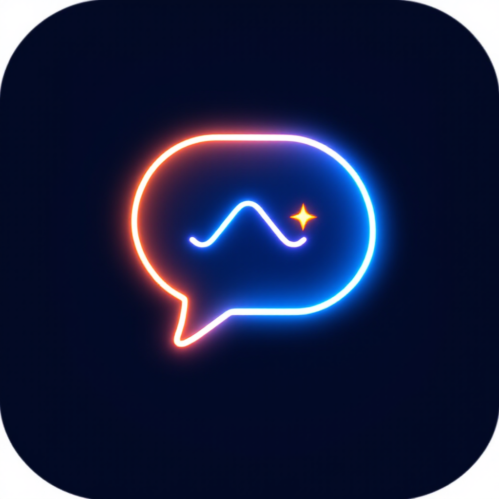
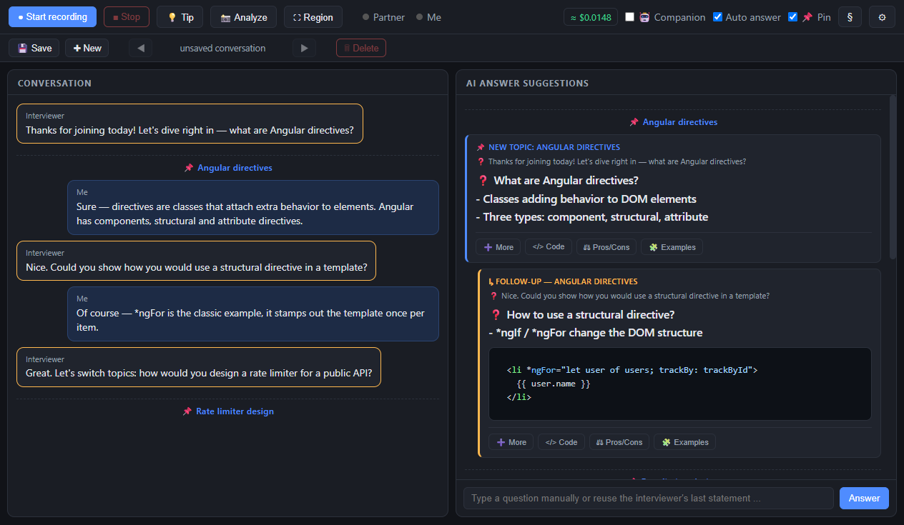
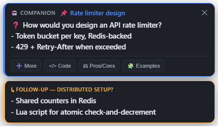
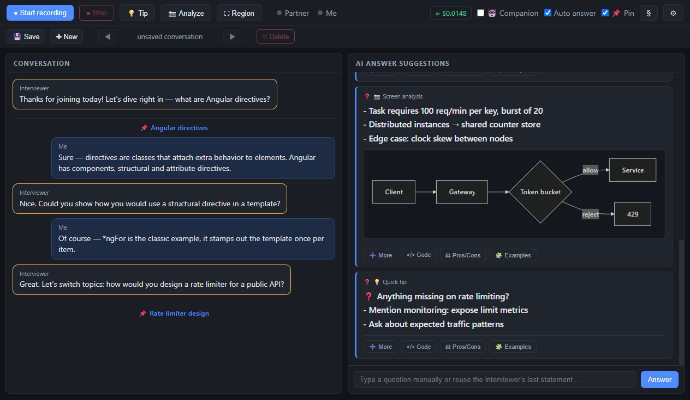

# Interview Helper — an open-source AI interview assistant

<p align="center"></p>

<p align="center"><em>An interview copilot that runs locally: live transcription and short AI answer hints for mock interview practice, powered by your own Replicate key.</em></p>

<p align="center">
  <a href="https://github.com/batsearchlight/ai-interview-assistant/actions/workflows/ci.yml"></a>
  <a href="https://github.com/batsearchlight/ai-interview-assistant/releases/latest"></a>
  <a href="LICENSE"></a>
</p>

## What is this?

Some interviews are basically quizzes. Someone reads questions off a list —
"What are Angular directives?", "How does a token bucket work?" — and you
answer until the list runs out. If you've ever blanked on something you
definitely know, that's the situation this tool is built for.

It listens to the call (your microphone and the system audio as separate
channels, so it knows who said what), transcribes everything live, and when a
question comes in it puts a short answer hint on your screen. Two or three
bullet points, not a wall of text.

It's meant for practicing: trivia rounds, mock interview practice, drilling a
specific topic before the real thing. All AI calls go through
[Replicate](https://replicate.com), so a single API key covers transcription,
answers and vision, and every model can be swapped for another one.

If you've come across commercial tools like Final Round AI, LockedIn AI or
Verve AI: this is the same category — a live interview AI that suggests answers
in real time — except it's open source, keeps everything on your machine, and
bills against your own Replicate key instead of a subscription.

## What it looks like

Transcript on the left, split by speaker. Suggestions on the right. Each
suggestion starts with the question as the AI understood it — which matters,
because speech recognition likes to turn "Angular directives" into "Angela
directives". Below that, one or two bullet points. If you need more, each card
has buttons for more detail, a code example, pros/cons, or concrete examples.



## Interview flow logic

The app doesn't just throw every sentence at an LLM. It first classifies what
the interviewer said:

- **New question or topic** → a 📌 marker appears in both panels and you get a
  fresh answer card. This also works when it isn't phrased as a question —
  "So, Angular directives." counts.
- **Follow-up on the current topic** → an indented ↳ card that only adds new
  information on top of what was already suggested, instead of answering the
  whole thing again.
- **Nothing new** (small talk, or the question is already covered) → no card.

The result reads like one thread per topic instead of a pile of unrelated AI
answers, and an old topic doesn't get overwritten just because a new one
started.

## Companion mode

Staring at a second window while someone is talking to you is pretty obvious.
Companion mode is the fix: the AI checks the conversation on its own — on an
interval, plus immediately when a question is detected — and shows its notes as
an overlay on a display of your choosing, so the hint is where you're already
looking.

<p align="center"></p>

A few details that took some iterations to get right:

- The note stays up while the question is open and goes away once the AI sees
  you've answered it.
- Follow-up questions are added as extra blocks below. The overlay grows
  instead of scrolling, and never replaces what you're currently reading.
- If the interviewer is still rephrasing their question, the AI waits rather
  than answering the wrong thing. If the question shifts after a note was
  already shown, it posts a "↳ Clarified" correction.
- A full topic change can be gated behind a click ("Switch" / "Keep"), so the
  overlay doesn't jump away mid-answer.
- The follow-up buttons (more / code / pros-cons / examples) are on the overlay
  as well.

## Screen analysis

Sometimes the important information is on the screen, not in the audio — a
shared task description, a code snippet, a diagram. Select a screen region
once, then hit **Analyze**: the screenshot plus the recent conversation goes to
a vision model and you get the key facts back, with a small Mermaid diagram
when structure is easier to read than prose.



There's also a quick tip button (Ctrl+T) that takes nothing but the
conversation history and suggests whatever seems most useful at that moment.

The screenshots show demo content, not a real conversation.

## Feature overview

- Dual-channel live transcription (mic + system loopback) with client-side VAD;
  long statements are split into segments so text shows up while people are
  still talking
- Interview flow classification: topic threading, follow-up detection, and
  staying quiet when there's nothing to add
- Companion overlay on any display, growing popup stack, no scrolling
- Screen region analysis with vision models, Mermaid rendering, code
  highlighting
- All three models (STT / LLM / vision) picked from live Replicate collections,
  or type any `owner/name` — the app reads each model's schema, so most
  community models work without code changes
- Languages: English, German, Hindi, Chinese, Japanese, Spanish, French, or
  auto-detect
- Session cost estimate in the top bar
- Save, browse and delete past conversations
- Legal notice that has to be accepted before recording starts

## Getting started

**Option 1 — download a build** from the
[releases page](https://github.com/batsearchlight/ai-interview-assistant/releases/latest):

| OS | File |
|---|---|
| Windows | `Interview-Helper-*-win-x64.exe` (installer) or `*-portable` |
| macOS | `Interview-Helper-*-mac-universal.dmg` (Intel + Apple Silicon) |
| Linux | `Interview-Helper-*-linux-x86_64.AppImage` or `.deb` |

The builds are not code-signed, so Windows SmartScreen / macOS Gatekeeper will
ask you to confirm the first launch (macOS: right-click → Open). System-audio
loopback capture currently only works on Windows; on macOS and Linux you need
a virtual audio device (BlackHole, PulseAudio monitor) routed into the
"partner" channel.

**Option 2 — run from source:**

```bash
npm install
npm start
```

Then:

1. Get a Replicate API key from https://replicate.com/account/api-tokens and
   put it into the settings (or set `REPLICATE_API_TOKEN`).
2. Optionally pick your models and fill in your profile (role, skills,
   projects). The profile goes into every prompt and is also what helps the AI
   reconstruct garbled technical terms.
3. Hit **Start recording**, share any screen when asked (only the audio is
   used), allow the microphone.

## Good to know

- Everything is stored locally in `%APPDATA%/interview-helper/` — the key,
  model choices and saved conversations. There is no telemetry.
- Latency vs. accuracy is a tradeoff you control: fast models
  (`anthropic/claude-4.5-haiku`, `openai/gpt-5-mini`) and 1 s segments for
  speed, bigger models and 3–5 s segments for quality.
- If you share your screen in a meeting, put the companion overlay on a
  display you are not sharing.
- **The serious part:** this is meant for practice and mock interviews.
  Recording real people requires their explicit consent — secretly recording
  non-public speech is a criminal offence in many jurisdictions (in Germany:
  § 201 StGB), and data protection laws like the GDPR apply on top. You are
  responsible for using this lawfully.

## Under the hood

```
main.js               Electron main: windows, settings, Replicate calls
                      (predictions with "Prefer: wait" for STT, SSE streaming
                      for LLMs, Files API for larger uploads, per-model schema
                      detection, model lists from Replicate collections),
                      companion overlay + prompts, cost tracking, conversations
preload.js            IPC bridge (contextBridge)
overlay-preload.js    IPC bridge for the region-selection overlay
companion-preload.js  IPC bridge for the companion overlay
renderer/
  index.html          main UI (top bar, conversation bar, transcript, answers,
                      settings and legal dialogs)
  app.js              audio capture (getDisplayMedia loopback + microphone),
                      energy VAD + utterance segmentation, question detection,
                      interview-flow control-line parsing, topic threading,
                      rendering (Mermaid + highlight.js), conversations
  overlay.html/js     drag-to-select screen region
  companion.html/js   companion overlay (popup stack, auto-resizing, actions)
  pcm-worklet.js      AudioWorklet: Float32 → PCM16 @ 16 kHz
  vendor/             mermaid.min.js, highlight.min.js + theme (bundled locally)
```

## License

MIT — see [LICENSE](LICENSE). Bundled libraries: [Mermaid](https://mermaid.js.org/)
(MIT) and [highlight.js](https://highlightjs.org/) (BSD-3-Clause), vendored
under `renderer/vendor/`.
